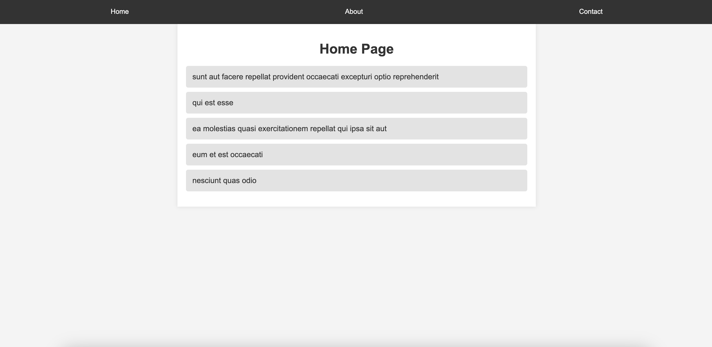
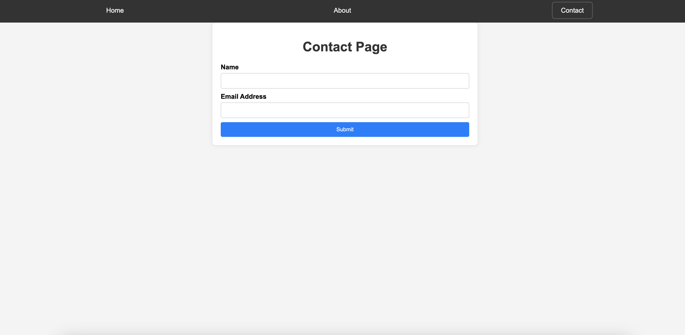
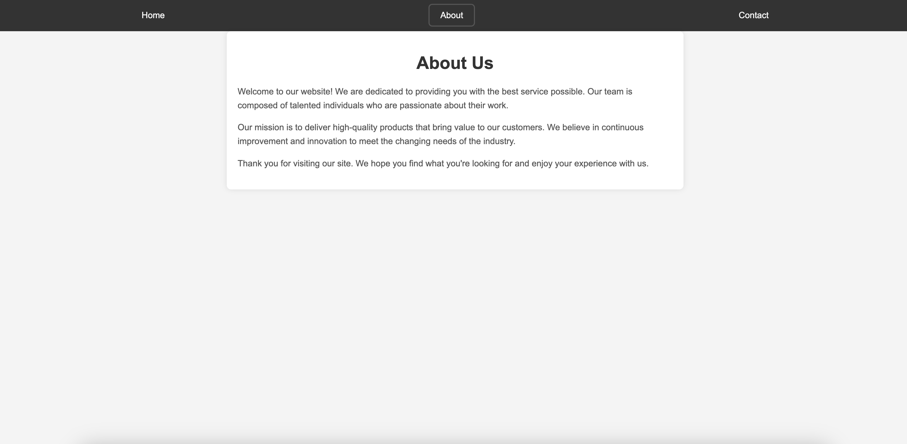

# React final

## Table of Contents

- [Project Overview](#project-overview)
- [Features](#features)
- [Technologies Used](#technologies-used)
- [Installation](#installation)
- [Screens](#screens)

## Project Overview

This project is a React-based web application designed to showcase a responsive user interface. It utilizes modern web development practices and libraries to create a seamless user experience across different devices.

## Features

- **Multiple Pages**: The application includes three main pages: Home, About, and Contact.
- **Form Handling**: Integrated form handling using Formik and Yup for validation ensures robust user interactions.
- **Animation**: Page transitions and elements are animated using Framer Motion, enhancing visual appeal.
- **Responsive Design**: The application is responsive, adapting to various screen sizes and orientations.
- **API Integration**: Fetches data from a mock API (JSONPlaceholder) to demonstrate dynamic content loading.

## Technologies Used

- **React**: Front-end JavaScript library for building user interfaces.
- **React Router**: Library for declarative routing in React applications.
- **Formik**: Form library for React to handle complex forms with ease.
- **Yup**: JavaScript schema builder for value parsing and validation.
- **Framer Motion**: Animation library for React to create fluid animations.
- **CSS**: Custom styling and responsive design using CSS.

## Installation

1. Clone the repository:
   ```bash
   git clone https://github.com/Zeizvant/react-final.git
2. Navigate into the project directory:
    ```bash
    cd react-final
3. Install dependencies:
    ```bash
    npm install

## Screens
### Home

### Contact

### About

